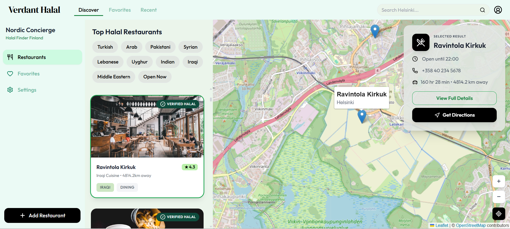
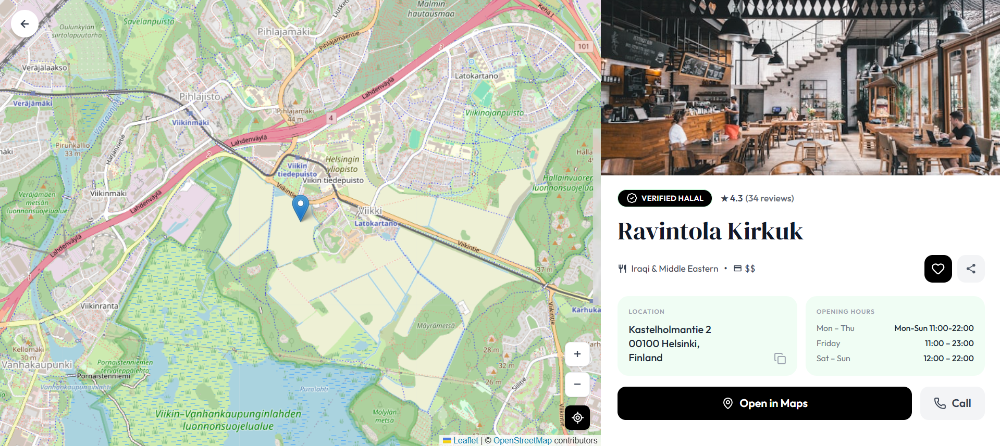

# 🕌 Verdant Halal — Halal Restaurant Finder Finland

<div align="center">


**Discover verified halal restaurants across Finland — on an interactive map.**

[](https://halal-restaurant-finder-gold.vercel.app/)
[](https://react.dev/)
[](https://tailwindcss.com/)
[](https://vitejs.dev/)
[](https://vercel.com/)

</div>

---

## 🌍 Live Demo

👉 **[https://halal-restaurant-finder-gold.vercel.app/](https://halal-restaurant-finder-gold.vercel.app/)**

---

## 📸 Screenshots

### Main View — 3-Column Layout
> Interactive map with restaurant list, menu sidebar and real-time filtering



### Restaurant Detail Page
> Full-screen detail view with map, opening hours, halal status and directions




---

## ✨ Features

- 🗺️ **Interactive Map** 
- 📍 **40+ Halal Restaurants**
- ✅ **Halal Verification Badges** 
- 🔍 **Live Search** 
- 🍽️ **Cuisine Filters** 
- 📏 **Real Distance & Drive Time** 
- 📌 **Pin Hover Tooltips** 

- 📋 **Selected Card Overlay**
- 📄 **Full Detail Page** 
- 🌐 **Google Sheets Data Source** 
- ⭐ **Real Ratings**
<!-- - 📱 **Responsive Design** — Works on mobile and desktop -->
- 🔄 **Fallback Data** 

---

## 🛠️ Tech Stack

| Technology | Purpose | Version |
|---|---|---|
| **React** | UI framework | 18.3 |
| **Vite** | Build tool & dev server | 5.4 |
| **Tailwind CSS** | Utility-first styling | 3.4 |
| **React Leaflet** | Interactive map | 4.2 |
| **Leaflet.js** | Map engine | 1.9 |
| **Lucide React** | Icon library | Latest |
| **Google Sheets** | Live data source (CSV) | — |
| **OpenStreetMap / CartoDB** | Map tiles | — |
| **Vercel** | Hosting & deployment | — |

---

## 📁 Project Structure

```
halal-finder/
├── 📁 screenshots
│   ├── 🖼️ detail.png
│   └── 🖼️ main.png
├── 📁 src
│   ├── 📁 components
│   │   ├── 📄 DetailPage.jsx
│   │   ├── 📄 MapView.jsx
│   │   ├── 📄 MenuSidebar.jsx
│   │   ├── 📄 Navbar.jsx
│   │   └── 📄 RestaurantList.jsx
│   ├── 📁 hooks
│   │   └── 📄 useRestaurants.js
│   ├── 📁 utils
│   │   ├── 📄 distance.js
│   │   └── 📄 sheetParser.js
│   ├── 📄 App.jsx
│   ├── 🎨 index.css
│   └── 📄 main.jsx
├── ⚙️ .gitattributes
├── ⚙️ .gitignore
├── 📝 README.md
├── 🌐 index.html
├── ⚙️ package-lock.json
├── ⚙️ package.json
├── 📄 postcss.config.js
├── 📄 tailwind.config.js
└── 📄 vite.config.js
```

---

## 🚀 Getting Started

### Prerequisites
- Node.js 18+
- npm or yarn

### Installation

```bash
# 1. Clone the repository
git clone https://github.com/aliatherayyubi/halal-restaurant-finder.git

# 2. Navigate into the project
cd halal-restaurant-finder

# 3. Install dependencies
npm install

# 4. Start the development server
npm run dev
```

Open [http://localhost:5173](http://localhost:5173) in your browser.

### Build for Production

```bash
npm run build
npm run preview
```

---

## 📊 Data Source — Google Sheets

The app fetches restaurant data live from a **publicly published Google Sheet** as CSV — no backend, no API keys needed.

### How it works

```
Google Sheet → Published as CSV → fetch() in browser → sheetParser() → React state → UI
```

### Sheet Columns

| Column | Type | Description |
|---|---|---|
| `name` | String | Restaurant name |
| `address` | String | Street address |
| `city` | String | City in Finland |
| `latitude` | Number | GPS latitude |
| `longitude` | Number | GPS longitude |
| `cuisine` | String | Cuisine type (Turkish, Indian…) |
| `halal_status` | String | Fully Halal / Halal Options |
| `phone` | String | Contact number |
| `website` | String | Website URL |
| `hours` | String | Opening hours |
| `image` | String | Photo URL |
| `rating` | Number | Star rating (1–5) |
| `review_count` | Number | Number of reviews |

### To connect your own sheet

1. Open your Google Sheet → **File → Share → Publish to web**
2. Select **Sheet1** and **CSV format** → click **Publish**
3. Copy the URL and paste it into `src/hooks/useRestaurants.js`:

```js
const SHEET_CSV_URL = 'https://docs.google.com/spreadsheets/d/e/YOUR_ID/pub?output=csv'
```

---

## 🗺️ Restaurant Coverage

| City | Restaurants |
|---|---|
| Helsinki | 22 |
| Tampere | 5 |
| Turku | 5 |
| Espoo | 2 |
| Jyväskylä | 3 |
| Oulu | 3 |
| **Total** | **40+** |

---

## 🌐 Deployment

### Deploy to Vercel (Recommended)

```bash
# Install Vercel CLI
npm i -g vercel

# Deploy
vercel
```

Or connect your GitHub repo directly at [vercel.com](https://vercel.com) for automatic deployments on every push.

### Deploy to Netlify

```bash
npm run build
# Drag and drop the /dist folder to netlify.com/drop
```

---

## 🤝 Contributing

Contributions are welcome! If you know of a halal restaurant in Finland that should be listed:

1. Fork the repository
2. Add the restaurant to the Google Sheet (or open an Issue with the details)
3. Submit a Pull Request

---

## 📄 License

MIT License — free to use, modify and distribute.

---

## 🙏 Acknowledgements

- Map tiles by [CartoDB](https://carto.com/) / [OpenStreetMap](https://www.openstreetmap.org/)
- Food photography by [Unsplash](https://unsplash.com/)
- Icons by [Lucide](https://lucide.dev/)
- Ratings sourced from Google Maps & Tripadvisor
- Built as an internship project for [NeuralFlex.io](https://neralflex.io)

---

<div align="center">

Made with ❤️ for the Muslim community in Finland 🇫🇮

**[🌐 Visit Live App](https://halal-restaurant-finder-gold.vercel.app/)**

</div>